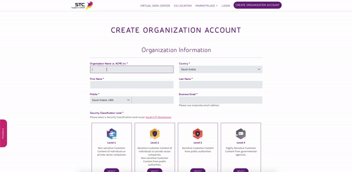
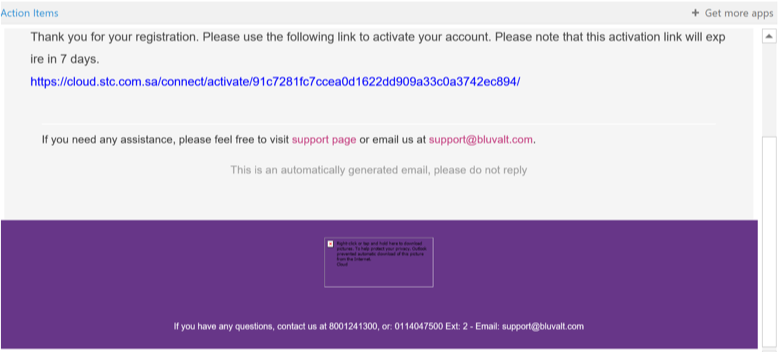
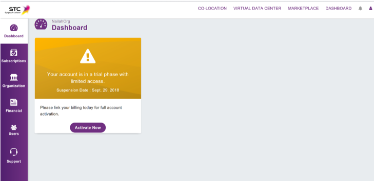
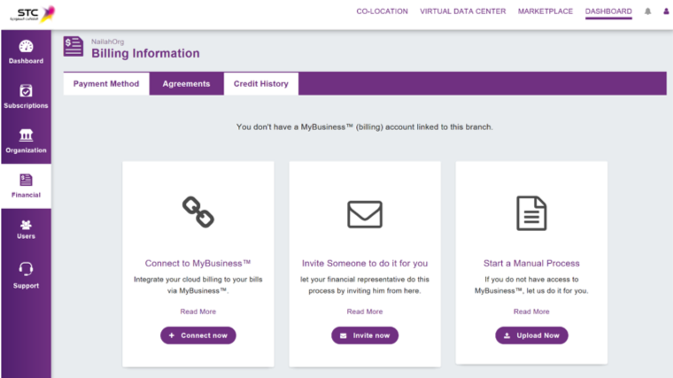

# Create Account in STC Cloud and Bluvalt Cloud

## Table of Contents
* [Introduction](#introduction)
* [Create Accont in STC Cloud](#create-accont-in-stc-cloud)

## Introduction
In this lab we will create our account in STC Cloud

## Create Accont in STC Cloud
In order to create an account for STC Cloud, follow the steps.

First open [STC Cloud](https://cloud.stc.com.sa/ "STC Cloud")

Next click on [Create Organization Account](https://cloud.stc.com.sa/customer/request-registration/ "create organization account").

Next fill all required fields

 

Note*
* For more information about Security Classification Level vist [Saudi Regulations](https://cloud.stc.com.sa/saudi-regulations/ "saudi-regulations")

* Referral code is simply a unique combination of numbers, letters, or both which you get it from STC.

Next
* Click on Create Organization Account
* A confirmation page will appear
* You will receive a confirmation email within 24 hours
* Once you have received your email, click on the activation link to access your account

Next after logging in your account information will open the main page of the account

Next
* To complete your STC Cloud registration and sign up for services, link your MY BUSINESS account for billing.

* If you do not have a MY BUSINESS account, please visit your nearest STC Aamal branch, contact your account manager or call 909

* To link the account please click on financial and choose the account link.

You will see the registration page, enter your My BUSINESS account and then the password, then press (next step) so that your account is linked.

Congratulation!
Now you can subscribe (Subscriptions) and enjoy all STC Cloud services available.
