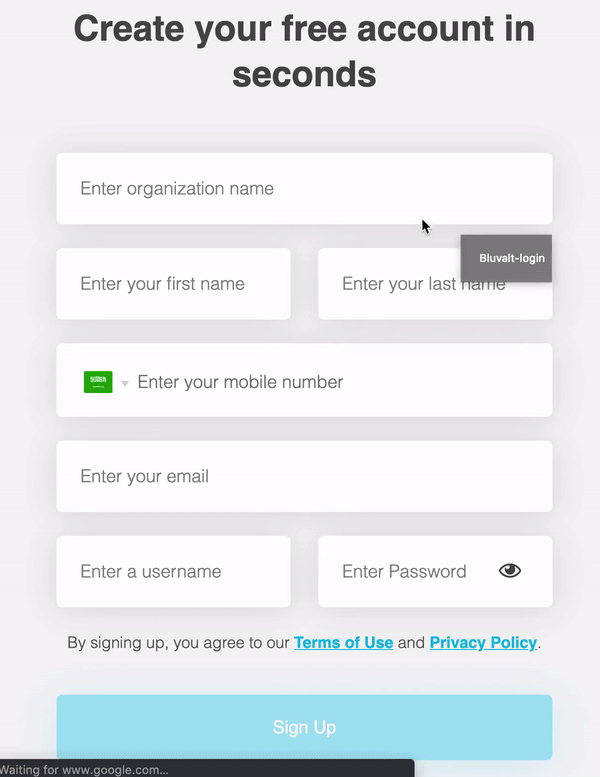
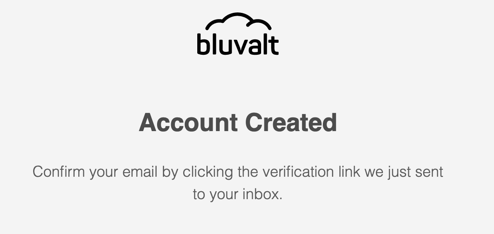
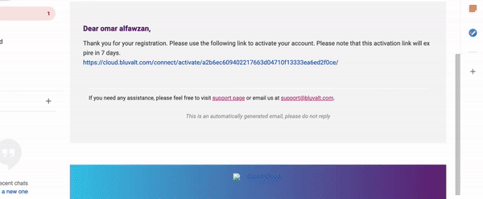

# Create Account in STC Cloud and Bluvalt Cloud

### Table of Contents
* [Introduction](#introduction)
* [Lab Steps](#lab-steps)
* [Conclusion](#conclusion)

### Introduction
In this lab we will create our account in STC Cloud and Bluvalt Cloud.

### Lab Steps
* 1. [Create Accont in STC Cloud](#create-accont-in-stc-cloud)
* 2. [Create Accont in Bluvalt Cloud](#create-accont-in-bluvalt-cloud)

### Create Accont in STC Cloud
First open [STC Cloud](https://cloud.stc.com.sa/ "STC Cloud")

### Create Accont in Bluvalt Cloud
First open [Bluvalt Cloud](https://cloud.bluvalt.com/ "Bluvalt Cloud").

Next click on [Sign Up](https://cloud.bluvalt.com/#/register "Sign Up").

Next fill all required fields

Next Click Sign Up

Next open your email and confirm your registration

Congratulation!

Now you can login and start using Bluvalt Cloud