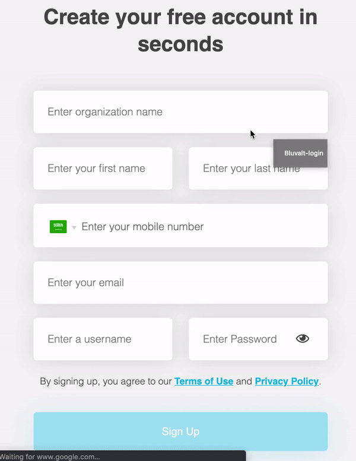
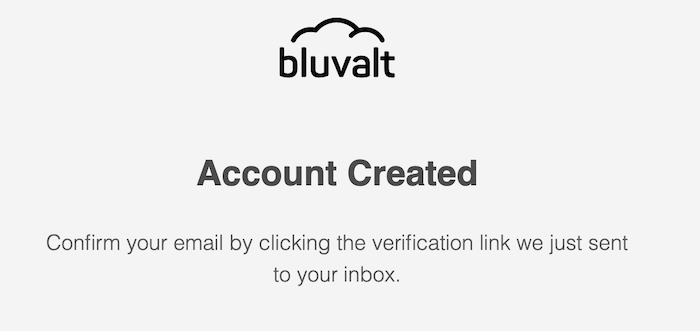
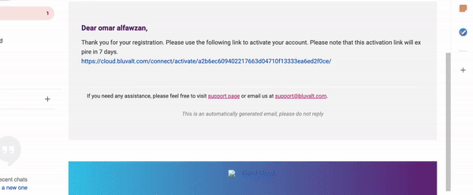

# Create Account in Bluvalt Cloud

## Table of Contents
* [Introduction](#introduction)
* [Create Accont in STC Cloud](#create-accont-in-stc-cloud)

## Introduction
In this lab we will create our account in STC Cloud and Bluvalt Cloud.

## Create Accont in Bluvalt Cloud
In order to create an account for Bluvalt Cloud, follow the steps.

First open [Bluvalt Cloud](https://cloud.bluvalt.com/ "Bluvalt Cloud").

Next click on [Sign Up](https://cloud.bluvalt.com/#/register "Sign Up").

Next fill all required fields

Next Click Sign Up

Next open your email and confirm your registration

Congratulation!

Now you can login and start using Bluvalt Cloud