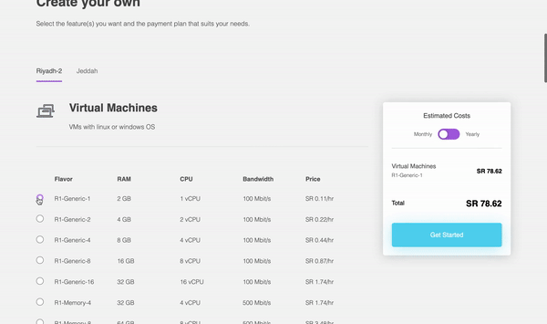
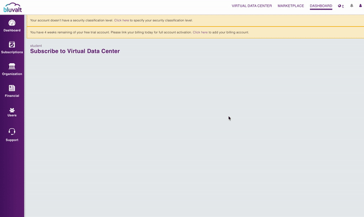
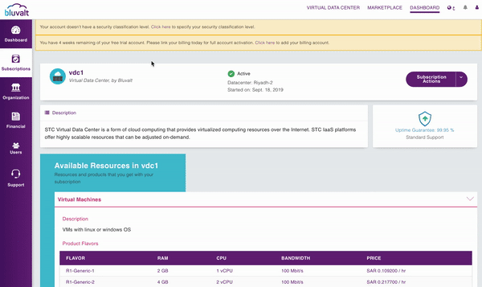
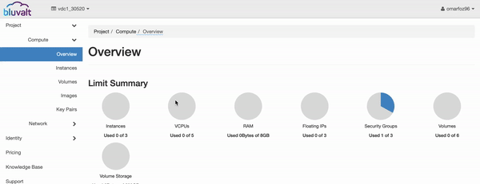
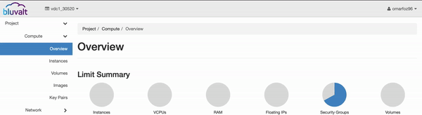
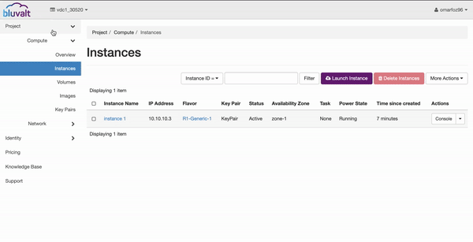
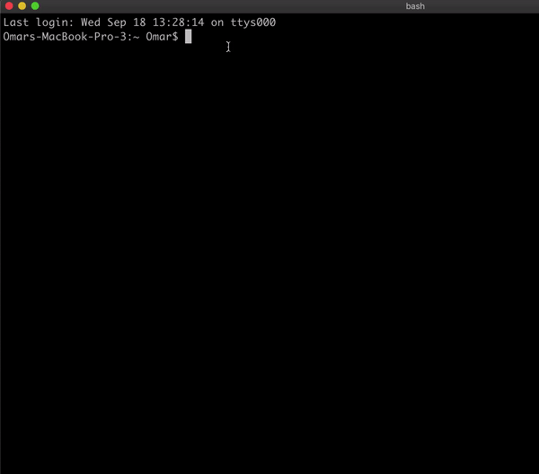
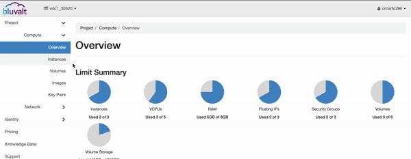

# Virtual Data Center

 <p align="center">
  
</p>


### Table of Contents
* [Introduction](#introduction)
* [Prerequisites](#prerequisites)
* [Lab Steps](#lab-steps)
* [Conclusion](#conclusion)

### Introduction
In this lab we will make our own Virtual Data Center Service using Bluvalt Cloud.
* Virtual Data Center
 is a form of cloud computing that provides virtualized computing resources over the Internet


## Prerequisites
* [Bluvalt Cloud Account](https://cloud.bluvalt.com/#/register "Bluvalt Cloud")
 

## Lab Steps
* 1. [Create Virtual Data Center](#1.-create-virtual-data-center-service)
* 2. [Accsess to VDC Service](#2.-accsess-to-vdc-service)
* 3. [Creating a Virtual Router](#3.-creating-a-virtual-router)
* 4. [Creating a Virtual Network](#4.-creating-a-virtual-network)
* 5. [Creating a Security Group](#5.-creating-a-security-group)
* 6. [Creating a Key Pairs](#6.-creating-a-key-pairs)
* 7. [Creating or Launching a Virtual Instance](#7.-creating-or-launching-a-virtual-instance)
* 8. [Assign Floating IP to The Instance](#8.-assign-floating-ip-to-the-instance)
* 9. [Connecting to The Virtual Instance](#9.-connecting-to-the-virtual-instance)
* 10. [Change Root Password](#10.-change-root-password)
* 11. [Access to the Virtual Instance by console in VDC Service](#11.-access-to-the-virtual-instance-by-console-in-vdc-service)


### 1. Create Virtual Data Center Service
#### [Virtual Data Center Link ](https://cloud.bluvalt.com/#/virtual-data-center/ "Virtual Data Center Link")



### 2. Accsess to VDC Service 


### 3. Creating a Virtual Router 
#### Folow the [Video Guide](https://kb.bluvalt.com/uploads/Create_router.mp4 "Video Guide")

```
Router Name = Router 1
```

### 4. Creating a Virtual Network 
#### Folow the [Video Guide](https://kb.bluvalt.com/uploads/create_network.mp4 "Video Guide")
```
Network Name = Network 1
Subnet Name = Subnet 1-1
Network Address = 10.10.10.0/24
```


### 5. Creating a Security Group
A security group is a named collection of network access rules that are use to limit the types of traffic that have access to instances. When you launch an instance, you can assign one or more security groups to it. 

```
Note*
For this lab we will allow all traffic so is not recommended for real application.
```


 ```
 Security Name = Security Group 1
 Rule = ALL TCP
 ```

### 6. Creating a Key Pairs

```
Key Pairs Name = KeyPair
```

### 7. Creating or Launching a Virtual Instance 
#### Folow the [Video Guide](https://youtu.be/Z7Q5n6i7dHI "Video Guide")

```
Note*
For this lab we will Select Ubuntu-18.04-LTS Image, You can select anything you want.
```

```
Instance Name = Instance 1
Availability Zone = zone-1
Count = 1
Boot Source = Image
Volume Size = 60
Select Image = Ubuntu-18.04-LTS
Flavors = R1-Generic-1
Networks = Network 1
Security groups =  security groups 1
Key Pairs = Key Pairs 1 
```


### 8. Assign Floating IP to The Instance 


### 9. Connecting to The Virtual Instance  
```
Note*
For this lab we will connect to Ubuntu-18.04-LTS
```
For every Image there a way to connect them please visit The [Knowledge base](https://kb.bluvalt.com/ "Knowledge base") for more information



Open the Terminal and Enter:
```
sudo su 
ssh -i [path of key pair ]/keypair.pem ubuntu@[floatingip] 
```
Example: ssh -i /Users/Omar/Downloads/keypair.pem ubuntu@95.177.166.233

### 10. Change Root Password
```
sudo su 
```
Then set a password for root user too

```
passwd root
```
and enter the new password for root user and confirm the same.

Then
```
service ssh restart  
```

### 11. Access to the Virtual Instance by console in VDC Service



## Conclusion 
Congratulations! You now have your own Virtual Data Center Service. You can start deploy your Applcations in the cloud!.

